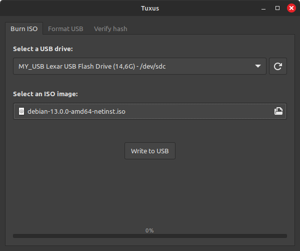
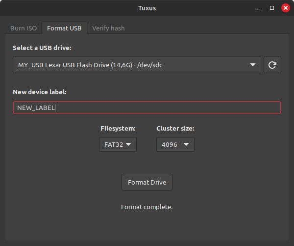
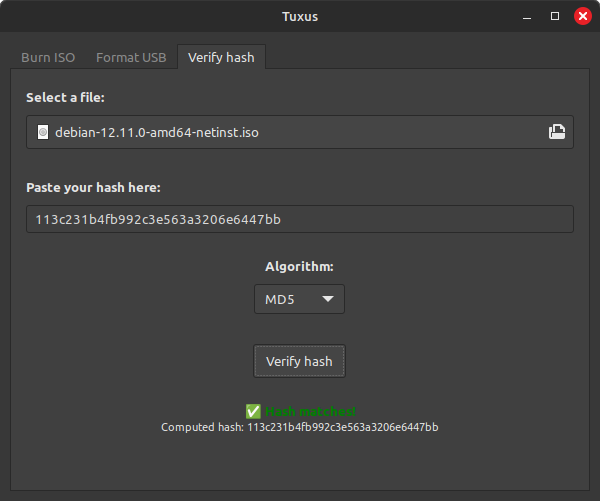

# TUXUS  
*A clean and powerful ISO burning & USB drive formatting app for Linux.*


---

## 💿 About TUXUS
TUXUS is a lightweight Python GTK application that makes it effortless to prepare USB drives and burn ISO images. Whether you’re flashing a Linux distribution or just reformatting a drive, TUXUS provides a modern interface with essential power-user features. It uses Python to execute widely available Bash commands such as mkfs, umount, md5sum, etc. on Debian and its derivatives.  
Initially created for personal use, TUXUS was later refined and made available to the public, specifically for users switching to Linux for the first time and for those who prefer a graphical user interface to perform quick tasks without the need to remember a series of long commands. It offers both basic and advanced options to satisfy a broader audience. Casual users can use the default settings, while advanced users can customize the options to meet their specific needs.

---

## 📀 Features
- Format drives with **FAT32, NTFS, exFAT, ext4**
- Burn ISO images directly to USB drives
- Verify file integrity with multiple hash algorithms
- User-friendly GTK interface with confirmation dialogs
- Smart options: filesystem label length checks, cluster size, and more

---

## 🛠️ Installation

### Option 1: Install via `.deb` package (recommended for most users)

Download the latest `.deb` release from the [Releases page](github.com/santofrancesco/tuxus/releases) and install it with:
```bash
sudo dpkg -i tuxus_x.y.z.deb    # replace x.y.z with the version you want to install
sudo apt-get install -f   # to resolve any missing dependencies
```

After installation, you can launch TUXUS from your application menu or by running:
```bash
tuxus
```

### Option 2: Run from source (for developers)

Clone the repository:
```bash
git clone https://github.com/santofrancesco/tuxus.git
cd tuxus
```

Install Python dependencies:
```bash
pip install -r requirements.txt
```

Run the application:
```bash
python3 main.py
```

---

## 📸 Screenshots
<div style="text-align: center;">
    <figure>
        
        <figcaption>Burn ISO images to USB drives</figcaption>
    </figure>
    <figure>
        
        <figcaption>Format USB drives</figcaption>
    </figure>
  <figure>
        
        <figcaption>Verify any file's integrity</figcaption>
    </figure>
</div>

---

## 📖 License
(work in progress)
